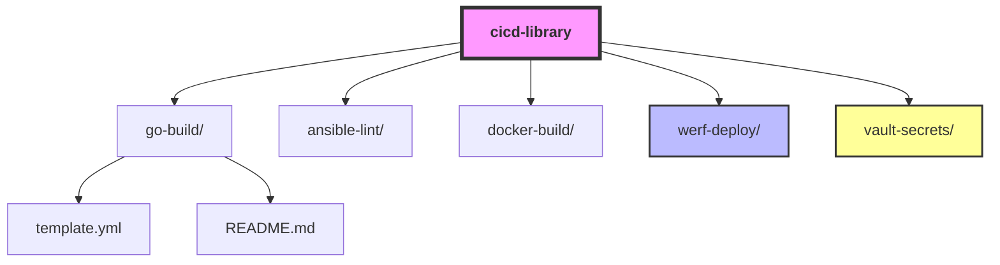

# Техническое Задание (ТЗ): Платформа стандартизированных CI/CD компонентов CSTLab

**Версия:** 1.0
---

## 1. Введение и Цели

### 1.1. Проблема
В текущей инфраструктуре CSTLab каждый студенческий проект пишет свои `.gitlab-ci.yml` файлы с нуля. Это приводит к:
*   Дублированию кода и конфигураций.
*   Различиям в подходах к безопасности и сборке.
*   Сложности поддержки и обновления инструментов (например, смены версии Go или Helm).
*   Ошибкам новичков при настройке деплоя в Kubernetes.

### 1.2. Цель проекта
Создать централизованную библиотеку переиспользуемых **GitLab CI/CD Components**, которая позволит собирать пайплайны как конструктор. Внедрить единые стандарты сборки, тестирования и деплоя для всех проектов школы.

### 1.3. Ключевые результаты (KPI)
1.  Библиотека из минимум 5 готовых, протестированных компонентов.
2.  Прототип "Конструктора пайплайнов" (CLI или Web UI), генерирующий валидный YAML.
3.  Минимум 3 реальных проекта CSTLab, мигрировавших на новые компоненты.
4.  Полная документация с примерами `include`.

## 2. Технологический стек

Проект строго опирается на следующую инфраструктуру CSTLab:
*   **VCS & CI/CD:** GitLab EE (внутренний инстанс).
*   **Containerization:** Docker / Podman.
*   **Orchestration:** Kubernetes (управляется через **Deckhouse**).
*   **Deployment Tools:** **Werf** (основной инструмент деплоя), Helm (как альтернатива/дополнение).
*   **Secrets Management:** **HashiCorp Vault**.
*   **Configuration Management:** Ansible (для подготовки окружений, если требуется).
*   **Language Support:** Go (Golang), Python, Node.js (базовая поддержка).
*   **Auth:** Keycloak (через OIDC/JWT для доступа к секретам).

## 3. Архитектура решения

Решение строится вокруг механизма **[GitLab CI/CD Components](https://docs.gitlab.com/ee/ci/components/)**.

### 3.1. Структура репозитория компонентов
Создается единый репозиторий `cstlab/cicd-library`.
Структура:

### 3.2. Механизм работы
1.  Пользователь добавляет компонент в свой `.gitlab-ci.yml` через директиву `include: component`.
2.  Компонент принимает входные параметры (`inputs`) с дефолтными значениями.
3.  GitLab подставляет шаблон компонента в пайплайн пользователя во время выполнения.

## 4. Детальное описание компонентов

Необходимо реализовать следующие компоненты. Каждый компонент должен быть версионирован по SemVer.

### 4.1. Компонент: `go-build`
*   **Функция:** Сборка бинарного файла Go-приложения, запуск unit-тестов, проверка линтером (`golangci-lint`).
*   **Inputs:** `go-version` (default: "1.21"), `binary-name`, `main-path`.
*   **Артефакты:** Скомпилированный бинарник.
*   **Ресурс:** [Go Docker Image Docs](https://hub.docker.com/_/golang)

### 4.2. Компонент: `ansible-check`
*   **Функция:** Запуск `ansible-lint` для проверки стиля и `molecule test` для интеграционного тестирования ролей.
*   **Inputs:** `role-path`, `ansible-version`.
*   **Ресурс:** [Ansible Lint Docs](https://ansible.readthedocs.io/projects/lint/)

### 4.3. Компонент: `docker-build`
*   **Функция:** Сборка Docker-образа, сканирование на уязвимости (опционально, например, Trivy), push в GitLab Container Registry.
*   **Inputs:** `dockerfile-path`, `image-tag` (default: `$CI_COMMIT_SHORT_SHA`).
*   **Важно:** Использовать многоступенчатую сборку для минимизации размера образа.

### 4.4. Компонент: `werf-deploy`
*   **Функция:** Деплой приложения в Kubernetes кластер Deckhouse с использованием Werf.
*   **Inputs:** `environment` (staging/production), `namespace`, `werf-config-path`.
*   **Требование:** Компонент должен автоматически аутентифицироваться в реестре и кластере.
*   **Ресурс:** [Werf Documentation](https://werf.io/)

### 4.5. Компонент: `vault-secrets`
*   **Функция:** Безопасное получение секретов (токены, пароли) из HashiCorp Vault перед этапом деплоя.
*   **Механизм:** Аутентификация через JWT токен GitLab CI (`CI_JOB_JWT_V2`).
*   **Inputs:** `vault-path`, `vault-role`.
*   **Ресурс:** [Vault JWT Auth](https://developer.hashicorp.com/vault/docs/auth/jwt)

## 5. Дополнительная задача: Конструктор пайплайнов

Разработать инструмент (Web UI или CLI на Python/Go), который:
1.  Предлагает пользователю выбрать нужные компоненты из списка.
2.  Запрашивает необходимые `inputs` для каждого выбранного компонента.
3.  Генерирует итоговый файл `.gitlab-ci.yml`, готовый к копированию.
4.  Валидирует полученный YAML на синтаксические ошибки.

*Это не обязательная часть MVP, но желательная для удобства пользователей.*

## 6. Требования к качеству и безопасности

1.  **SemVer:** Все компоненты должны иметь теги версий (v1.0.0, v1.0.1). Пользователи должны подключать конкретные версии или диапазоны (`~1.0`).
2.  **Безопасность по умолчанию:**
    *   Никаких хардкод-паролей.
    *   Использование переменных окружения GitLab (`$CI_REGISTRY_PASSWORD`).
    *   Минимальные привилегии для сервисных аккаунтов.
3.  **Тестирование компонентов:**
    *   В репозитории библиотеки должен быть свой CI пайплайн, который проверяет валидность YAML каждого компонента.
    *   Желательно иметь "test-project", где автоматически прогоняются все компоненты при изменении кода.

## 7. Документация и Knowledge Sharing (Критически важно!)

Так как проект рассчитан на широкое использование студентами, документация является частью продукта.

### 7.1. Структура документации
1.  **Главный README.md** в корне репозитория библиотеки:
    *   Краткое описание: "Зачем это нужно?"
    *   Quick Start: Пример минимального `.gitlab-ci.yml` с подключением одного компонента.
    *   Таблица доступных компонентов со ссылками.
2.  **README.md внутри каждой папки компонента:**
    *   Описание: Что делает компонент.
    *   Inputs: Таблица всех входных параметров, их типы и дефолтные значения.
    *   Example: Полный рабочий пример использования именно этого компонента.
    *   Troubleshooting: Частые ошибки и их решения.

### 7.2. Как делиться знаниями (Process)
1.  **Demo Day:** В конце каждой недели команда проводит 15-минутную демонстрацию нового компонента.
2.  **Internal Wiki:** Создать страницу на внутренней Wiki (или в GitLab Pages), где описана архитектура платформы.
3.  **Code Review Guidelines:** Написать чеклист для ревью чужих пайплайнов (на что смотреть, какие компоненты рекомендовать).
4.  Провести один воркшоп "Как собрать свой первый пайплайн за 10 минут", записать видео и выложить в общий доступ.

> **Правило:** "Если компонента нет в документации — его не существует". Код без документа не принимается в Merge Request.

## 8. План работ (Roadmap)

### Этап 1: Исследование и База
*   Изучение документации GitLab Components.
*   Настройка репозитория `cicd-library`.
*   Реализация компонентов `go-build` и `docker-build`.
*   Настройка CI для самой библиотеки (валидация YAML).

### Этап 2: Интеграция и Безопасность
*   Реализация компонента `vault-secrets` (настройка JWT Auth в Vault).
*   Реализация компонента `werf-deploy`.
*   Тестирование связки: Build -> Push -> Deploy на тестовом стенде.

### Этап 3: Удобство и Масштабирование
*   Реализация компонента `ansible-check`.
*   Разработка прототипа Конструктора (Web/CLI).
*   Написание полной документации.

### Этап 4: Внедрение и Поддержка
*   Миграция 2-3 пилотных проектов студентов на новую библиотеку.
*   Сбор фидбека, исправление багов.
*   Финальная презентация и передача знаний.

## 9. Риски и Митигация

| Риск | Вероятность | Влияние | Митигация |
|------|-------------|---------|-----------|
| Сложность настройки Vault JWT | Высокая | Блокировка деплоя | Начать с моков секретов, параллельно изучать Vault docs. Привлечь ментора. |
| Студенты не хотят менять старые пайплайны | Средняя | Низкое adoption | Сделать миграцию максимально простой (copy-paste 5 строк). Показать выгоду в скорости. |
| Изменения в API GitLab/Werf | Низкая | Поломка компонентов | Использовать стабильные версии инструментов. Пинить версии образов. |

---
